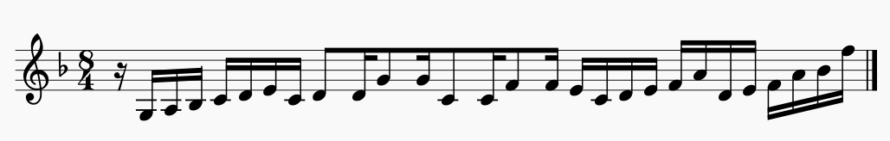

# 吉松 隆 Yoshimatsu, Takashi - "Cyber-bird" Concerto, Op. 59

## Background information

Solo instruments: Alto saxophone, piano, percussion

Composed: Fall 1993 - Spring 1994

Important people: The piece was commissioned by saxophonist Nobuya Sugawa, to be played by him
along with pianist Minako Koyagi and percussionist Takako Yamaguchi \[[^1]\].

Premiere information: Premiered on Mar. 21, 1994, by the Yomiuri
Symphony Orchestra (conductor: Masahiko Enkoji) \[[^2]\].

Published by: ASKS Orchestra (<https://asks-orch.com/>).

Recording history: Nobuya Sugawa has recorded this concerto twice (TOCE-9152, CHAN-9737).
There don't appear to be any other significant recordings.

## Significance

Yoshimatsu has written quite a few concertos (10) for a variety of solo instruments,
so it seemed appropriate to include one on this list.
He's an interesting composer in the sense that his music is quite tonal, and his style is
heavily influenced by Western popular music - namely, jazz and rock.
The Cyber-bird Concerto, with its various jazz elements ranging from swing sections to
sections of free jazz imitation, illustrates these characteristics well.

The piece is also interesting because while it predominantly features the saxophone,
the piano and drumset/percussion are also afforded significant solo roles.
Yoshimatsu describes it as being "a kind of triple concerto" for these
three instruments \[[^3]\].

## Analysis

Timestamps are in reference to the 1999 recording by Nobuya Sugawa (linked below).

### I. Bird in Colors

The form of this section appears loosely inspired by traditional concerto form, but it doesn't
neatly follow the pattern one might expect.
Instead, the main theme is presented several times, each time in a different way,
usually separated by atmospheric interludes.

Yoshimatsu describes this movement as "a somewhat frenzied Allegro in which a bird
flies through strata of varying colours" - presumably, the saxophone is the bird,
and the orchestra, driven by the piano and drums, produce the changing colors.

The "A" theme presented in the saxophone and piano starts as follows:

0:00 - Solo saxophone and piano present the "A" theme

0:55 - "A" theme is replayed and developed by the saxophone, with drumset and piano acting as a rhythm section. Orchestral accompaniment is generally sparse.

1:46 - Strings reiterate "A" with saxophone silent, piano and drums as background parts.

2:13 - Return of the saxophone/piano texture, playing "A" again but with added special effects

2:35 - "A" theme devolves into a sound-mass, heavy on ambient noise from cymbals, strings, and saxophone

3:00 - Lyrical "B" theme is introduced by the piano, with the saxophone following later

4:08 - "A" theme makes its return, woven on top of the lighter background texture from the "B" section

4:25 - Swing section begins, with the drumset and piano establishing the groove. Solo flute plays the "A" theme in the new swing feel; saxophone joins later

5:07 - "A" theme breaks down again, this time into a frantic texture with a driving rhythm section, reminiscent of free jazz

6:03 - Free jazz texture subsides into a more relaxed atmospheric texture similar to 2:35

6:20 - Saxophone enters with a loose, improvisatory variation on the "A" theme, over plodding fifths in the piano (a sort of slow cadenza?). The orchestra steadily crescendoes behind the saxophone until...

7:44 - Orchestral crescendo ends; soloists drop out, and the strings play sustained chords and short, slow figures

8:09 - Saxophone and piano return with the "A" theme, close to how it was presented initially

### II. Bird in Grief

This movement starts at 8:48 in the recording (which has all movements combined).

TODO - Movement description (like for mvt. 1)

TODO - Incipit

8:48 - Piano presents mournful "A" material

9:38 - Saxophone enters with lyrical, improvisatory "B" material, while the piano continues playing its original material

10:35 - Saxophone plays around the "A" material in an loosely improvisatory way. Piano also continues with "A"

11:21 - Saxophone improvisation becomes more virtuosic

12:08 - 

### III. Bird in the Wind

TODO - Movement description (like for mvt. 1)

TODO - Incipit

TODO - Analysis

## Recordings

### Nobuya Sugawa, 1999 (CHAN-9737)

<iframe width="560" height="315" src="https://www.youtube.com/embed/Xp9zhpuRlUw" frameborder="0" allow="accelerometer; autoplay; encrypted-media; gyroscope; picture-in-picture" allowfullscreen></iframe>

Sugawa's recordings (on two different CDs) seem to be the only published recordings of this piece.
Yoshimatsu and Sugawa have a fairly long history of collaboration that has produced several
excellent pieces for saxophone, so Sugawa seems to bring a uniquely authentic interpretation to
Yoshimatsu's works.
His sense for expression and somewhat unrestrained playing make the wilder parts of this concerto
feel really energetic; he also brings an appropriate sense of style to the jazz-influenced
sections of the piece, and again shows off his expressive sense during the lyrical moments.
(Needless to say, I like this recording a lot.)

## References

[^1]: Yoshimatsu, Takashi. Liner notes to *Yoshimatsu: Symphony No. 3 · Saxophone Concerto*. CD CHAN 9737. Chandos Records, 1999. <https://www.chandos.net/chanimages/Booklets/CH9737.pdf>

[^2]: "Works," Yoshimatsu Takashi Home Page. Composer's website. <http://yoshim.music.coocan.jp/~data/EnglishPage/worksE.html>

[^3]: See source 1.
