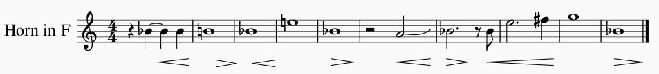

# 細川 俊夫 Hosokawa, Toshio - Horn Concerto, "Moment of Blossoming"

## Background information

Solo instrument: Horn

Composed: 2010

Important figures: Stefan Dohr (dedicatee and premiere hornist);
also jointly commissioned by the Berlin Philharmonic, the Amsterdam
Concertgebouw, and the Barbican Centre in London \[[^1]\].

Premiere information: Premiered by the Berlin Philharmonic in 2011,
with Simon Rattle conducting \[[^2]\].

Published by: Schott Music

Recording history: This piece was recorded by the Royal Scottish National
Orchestra for a 2014 CD by Naxos (8.537239). There don't
appear to be any other released recordings.

## Further information

Hosokawa was born and raised in Hiroshima, Japan, but has studied and lived in Germany.
He writes in a variety of genres, including both orchestral works and opera,
and he has served as composer-in-residence with the Tokyo Symphony Orchestra, the
Deutches Symphonie Orchester (in Berlin), and the WDR Rundfunkchor (in Köln).
He is also a guest professor at the Tokyo College of Music.
His work is acclaimed for its fusion of Eastern and Western ideas \[[^3]\]\[[^4]\].

"Moment of Blossoming" is a musical representation of a lotus blossom flowering.
The lotus, shown below, is an important symbol in many religions, particularly
Buddhism (a common religion in Japan).

 \[[^5]\]

Hosokawa writes, "The lotus ... roots take nourishment from deep beneath the mud,
and its stalk passes straight up through the water ... [to bring] forth its beautiful
jewel-like blossoms. Without the chaotic world of the mud, the blossom could not open
toward the sky."
According to him, the lotus is often taken as a metaphor for human growth, and his
interpretation is part of a traditional Japanese trend of finding connections between
people and nature.
In this piece, the horn is the flower/person, emerging from the orchestra which
acts as the pond where the lotus blooms \[[^6]\].

## Analysis

This is a single-movement concerto.
Timestamps refer to the recording linked below (Naxos 8.537239).

0:00 - The piece begins with an ethereal section of sustained pitch in
the orchestra.
A lot of the sound comes form muted brass and aleatoric-sounding string
glissandi, which makes it somewhat difficult to tell exactly when the
horn emerges.

1:14 - At this point, the horn crescendos out from the texture slightly (on
the same unison pitch as the muted brass), then subsides back into the orchestra.

1:45 - The horn reappears, more noticeably this time. This process continues with
the horn becoming more and more distinct.

3:53 - The first melodic-sounding figures appear in the horn, echoed shortly
afterward by the woodwinds. This melody is shown below. The texture continues
to bubble with melodic fragments and the horn coming in and out for a while.

6:44 - A noticeable textural shift occurs, with the strings playing a melodic
figure over lush harmonies.
This is quickly taken up by the horn and muted trumpet.

7:18 - The texture becomes more dissonant and agitated, with some falling
glissandi in the wind parts and eventually the introduction of (audible)
timpani, peaking at around 7:50.

This conflicting section dies down but then resurges more gradually, coming
to a head again at 9:50 with dramatic high notes in the horn, followed by
wild trills and flutter-tonguing.

10:45 - The texture calms down again as the horn exits briefly.
It returns to an unsettling texture made of aleatoric-sounding strings again.

10:59 - The horn reenters, building back to the dramatic conflict heard earlier.

12:22 - The conflict ends suddenly, returning to a relatively tranquil texture
(sustained and soft) reminiscent of the beginning of the piece.

13:43 - Things begin to heat up again, in a similar way to before.

14:48 - Again, the "conflicting" texture ends suddenly, leaving behind some
uneasy-sounding strings. This is the last major moment of conflict in the
piece, possibly representing the opening of the lotus blossom.

15:40 - Melodic figures appear in the strings, soon echoed by the horn.
These string fragments are less dissonant than a lot of the previous music.
The horn continues to play occasional figures alongside the orchestral
instruments; it sounds more peaceful now.

This texture (melodic fragments with relatively consonant harmony, featuring
the horn fading in and out) eventually dissolves to the string texture from
the beginning of the work, which fades to nothing.

## Recordings

### Royal Scottish National Orchestra (2014)

Recording information \[[^7]\]:
- Horn: Stefan Dohr
- Conductor: Jun Märkl
- Label: Naxos
- Reference number: 8.573239

<iframe width="560" height="315" src="https://www.youtube.com/embed/TayhQbE7thE" frameborder="0" allow="accelerometer; autoplay; clipboard-write; encrypted-media; gyroscope; picture-in-picture" allowfullscreen></iframe>

This recording does an excellent job of conveying the narrative of the piece.
The way that the horn interacts with the orchestra is subtle: it fades in and
out of the spotlight, creating a sound that's texture-first rather than
horn-first.
This seems to fit well with the theme of the piece, since the horn (representing
the lotus blossom, or an individual) is just one emerging piece of a much
larger ecosystem.

## References

[^1]: Hosokawa, Toshio. Liner notes to *Toshio Hosokawa: Orchestral Works, Vol. 1*. CD Naxos 8.537239. Naxos Records, 2014. Publicly available at <https://www.naxos.com/mainsite/blurbs_reviews.asp?item_code=8.573239&catNum=573239&filetype=About%20this%20Recording&language=English> (linked from <https://www.naxos.com/catalogue/item.asp?item_code=8.573239>).

[^2]: Schott Music. "Horn Concerto -Moment of Blossoming-." Publisher's website. <https://en.schott-music.com/shop/horn-concerto-moment-of-blossoming-no277107.html>

[^3]: Naxos Records. "Toshio Hosokawa - Bio." <https://www.naxos.com/person/Toshio_Hosokawa/20268.htm>.

[^4]: Berliner Philharmoniker. "Portrait: Toshio Hosokawa." <https://www.berliner-philharmoniker.de/en/titelgeschichten/20192020/toshio-hosokawa/>

[^5]: Flower Glossary. "Lotus Flowers." <https://www.flowerglossary.com/lotus-flowers-meaning/>

[^6]: See source 1.

[^7]: See source 1.
