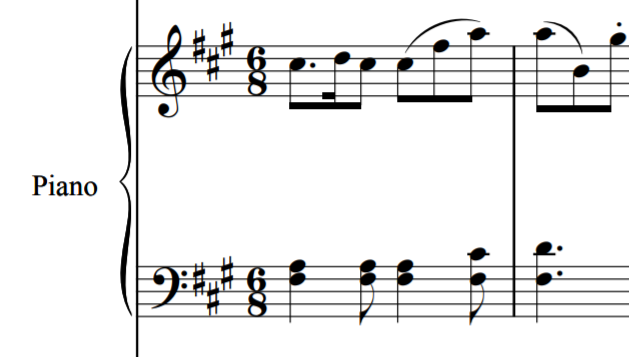

# 細川 俊夫 Hosokawa, Toshio - "Lotus under the moonlight" (Piano Concerto)

## Background information

Solo instrument: Piano

Composed: 2006

Important figures: Commissioned by the Norddeutscher Rundfunk (NDR) orchestra;
dedicated to Momo Kodama, the premiere pianist \[[^1]\].

Premiere information: Premiered by the NDR Sinfonieorchester in Hamburg (Germany),
2006, with Momo Kodama on piano and Jun Märkl conducting \[[^2]\].

Published by: Schott Music

Recording history: This piece was recorded by the Royal Scottish National
Orchestra for a 2014 CD by Naxos (8.537239). There don't
appear to be any other released recordings.

## Further information

This piano concerto was composed in commemoration of Mozart Year, 2006
(the 250th anniversary of Mozart's birth).
It uses the F#-minor second movement of Mozart's Piano Concerto in A Major,
K. 488, as thematic material (linked below).
In his liner note on the piece, Hosokawa writes that Mozart's music has been
some of his favorite European music since childhood.

<iframe width="560" height="315" src="https://www.youtube.com/embed/6Sxp9M0Jm4w?start=703" frameborder="0" allow="accelerometer; autoplay; clipboard-write; encrypted-media; gyroscope; picture-in-picture" allowfullscreen></iframe>

Like Hosokawa's horn concerto, "Moment of Blossoming," this concerto depicts
a scene involving a lotus flower, this time budding under the moonlight.
Hosokawa notes that the piece is centered around the a sustained F# (the key of
the Mozart movement used as source material), which represents "vibrations on
the water's surface." Lower notes represent the water and the mud below, while
higher notes represent the sky \[[^3]\].

For more information about the composer, see
[the page about his horn concerto](./07-hosokawa-moment-of-blossoming.md).

## Analysis

This concerto is a single-movement work.
Timestamps refer to the recording linked below (Naxos 8.573239).
In terms of style, this piece revolves around textures, which slowly
unfold and then subside.

0:00 - The piece opens with solo piano, playing a modified version of
the Mozart second movement discussed above that progressively gets
more chromatic/dissonant.
The original theme from Mozart is shown in the snippet below.

0:50 - The strings gradually enter under the piano from niente on a sustained F#.

1:38 - The orchestral parts begin to move around, and the piano becomes a bit
more active. This texture continues to build for a while. The rolled chord
pattern played by the piano here becomes a common feature in the rest of the piece.

3:16 - The piano begins playing heavy descending block chords, and the orchestral
parts reach into higher registers (creating the moonlit sky image discussed earlier).

3:56 - Texture thins out. The descending block chord motif is now being passed around
between the orchestra and piano.

This section then builds to a peak again, using the same textural devices as before
plus additional extended techniques in the orchestral winds (flutter-tongue,
more glissandi).

6:05 - Another moment where the texture thins out, dropping to silence this time.
The strings soon return with the sustained F# from the beginning of the piece,
over which the piano reenters with music that is also similar to the beginning
(lots of rolled chord figures).

The orchestra, meanwhile, has a lot of instrumental lines poking out in ways
that sound like secondary solos. This texture builds up for a while.

9:52 - The piano makes a noticeable, sudden drop down to the low register, then
moves up to very high notes.
This is likely another representation of the landscape spanning from the "mud"
where the lotus grows to the sky above, as mentioned in Hosokawa's notes
on the piece.

10:11 - Another figure in the piano that moves steadily from its low
register to its high register.
This upward motion and extremely wide range continues to be
a pattern in the piano part.

10:51 - Dissonant block chords in the highest register of the piano alternate
with chords in the lowest register of the piano.
Then the upward figure returns.

11:23 - Another moment where the music evaporates into silence.

11:52 - Solo piano reentry. Likely a modification of the Mozart theme again.
This is very much reminiscent of the beginning of the piece.

The piano plays alone for a long time, until 14:38.

14:38 - Return of the sustained F# in the strings and the downward chord
pattern in the piano (similar to 3:16). The texture here is similar to 1:38
or 6:05.

From this point onward, the texture remains thin and doesn't evolve much further.
There are some swells that sound like they could become dramatic, but they
dissipate before ever coming to a real peak.

18:01 - The most clear statement of the Mozart theme in the piece, even more so
than at the beginning.
The melody in the piano's right hand seems to be an exact quote, in time, while
the left-hand harmonies may be modified a bit.

19:00 - Past roughly this point, the music fades out (with some interesting
wind-like noises in the orchestra that are probably worth noting).

## Recordings

### Royal Scottish National Orchestra (2014)

Recording information \[[^4]\]:
- Piano: Momo Kodama
- Conductor: Jun Märkl
- Label: Naxos
- Reference number: 8.573239

<iframe width="560" height="315" src="https://www.youtube.com/embed/3SJeSgqtAN8" frameborder="0" allow="accelerometer; autoplay; clipboard-write; encrypted-media; gyroscope; picture-in-picture" allowfullscreen></iframe>

This recording does an excellent job of capturing the textural shifts in the
piece, much like in the recording of Hosokawa's horn concerto on the same CD.
Both the orchestra and the soloist seem cognizant of their roles and are
careful not to overwhelm each other, resulting in a blend that is overall
very effective.

## References

[^1]: Hosokawa, Toshio. Liner notes to *Toshio Hosokawa: Orchestral Works, Vol. 1*. CD Naxos 8.537239. Naxos Records, 2014. Publicly available at <https://www.naxos.com/mainsite/blurbs_reviews.asp?item_code=8.573239&catNum=573239&filetype=About%20this%20Recording&language=English> (linked from <https://www.naxos.com/catalogue/item.asp?item_code=8.573239>).

[^2]: Schott Music. "Lotus under the Moonlight." Publisher's website. <https://en.schott-music.com/shop/lotus-under-the-moonlight-no249988.html>

[^3]: See source 1.

[^4]: See source 1.
